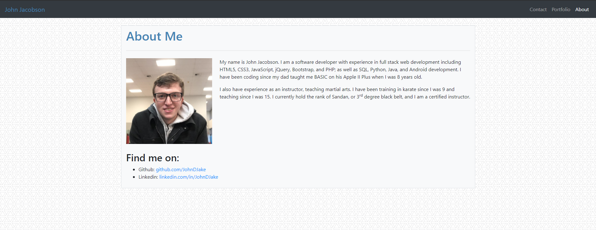

# Responsive Portfolio (Homework-02): John Jacobson

## Description

This is a portfolio website created with a responsive layout using Bootstrap. The home page has a brief description of my professional experience, as well as links to my Github and Linkedin profiles. The portfolio page has a responsive grid with placeholder images, and the contact page has a placeholder form.

In creating this project I learned the general usage for responsive layouts with Bootstrap.

[Deployed here on Github Pages](https://johndjake.github.io/responsive-portfolio/).

## Usage

Navigate the site using the navbar at the top of the page.

## Credits

* Made with [Bootstrap](https://getbootstrap.com).
* [Background pattern](https://www.toptal.com/designers/subtlepatterns/webb-pattern/) from [Toptal Subtle Patterns](https://www.toptal.com/designers/subtlepatterns), made by [Tomislava Babić](https://behance.net/antitomi).

## License

MIT License

Copyright (c) 2020 John Jacobson

Permission is hereby granted, free of charge, to any person obtaining a copy
of this software and associated documentation files (the "Software"), to deal
in the Software without restriction, including without limitation the rights
to use, copy, modify, merge, publish, distribute, sublicense, and/or sell
copies of the Software, and to permit persons to whom the Software is
furnished to do so, subject to the following conditions:

The above copyright notice and this permission notice shall be included in all
copies or substantial portions of the Software.

THE SOFTWARE IS PROVIDED "AS IS", WITHOUT WARRANTY OF ANY KIND, EXPRESS OR
IMPLIED, INCLUDING BUT NOT LIMITED TO THE WARRANTIES OF MERCHANTABILITY,
FITNESS FOR A PARTICULAR PURPOSE AND NONINFRINGEMENT. IN NO EVENT SHALL THE
AUTHORS OR COPYRIGHT HOLDERS BE LIABLE FOR ANY CLAIM, DAMAGES OR OTHER
LIABILITY, WHETHER IN AN ACTION OF CONTRACT, TORT OR OTHERWISE, ARISING FROM,
OUT OF OR IN CONNECTION WITH THE SOFTWARE OR THE USE OR OTHER DEALINGS IN THE
SOFTWARE.